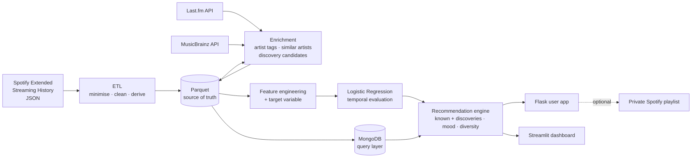
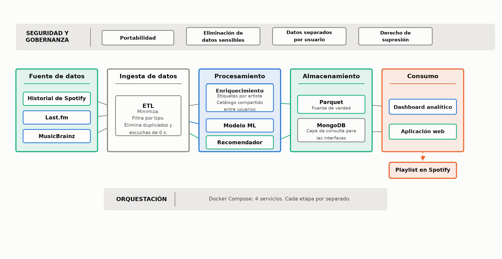
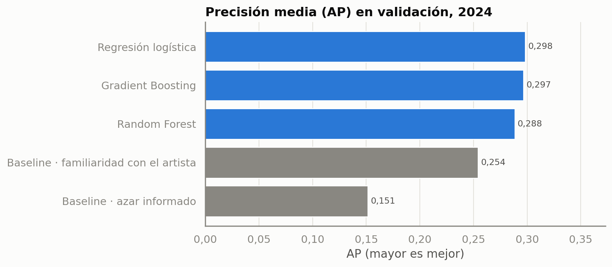
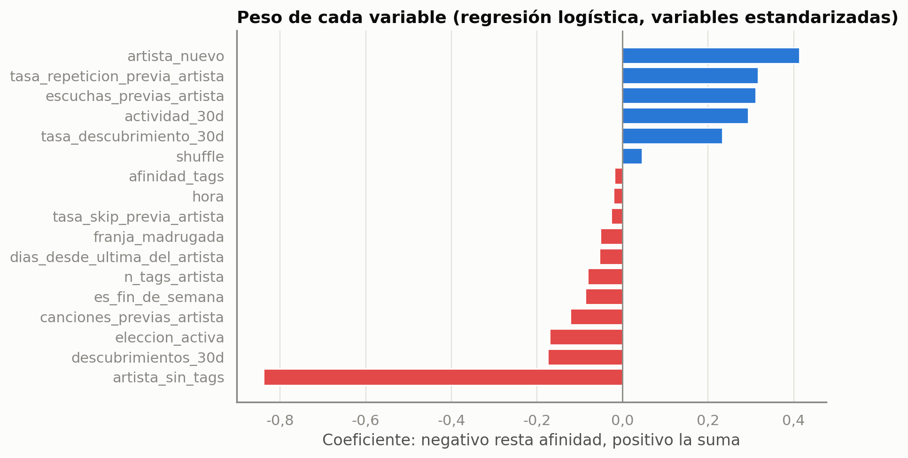
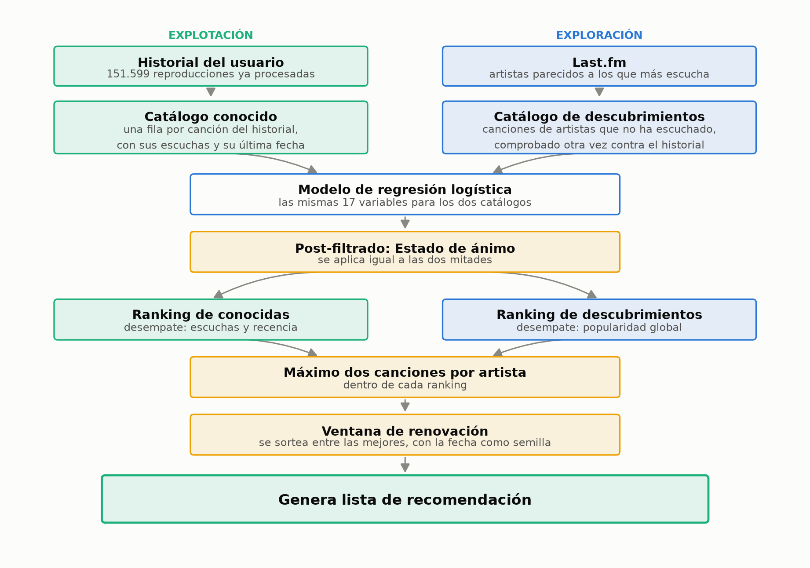
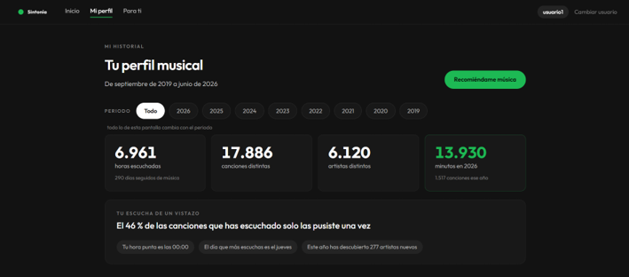
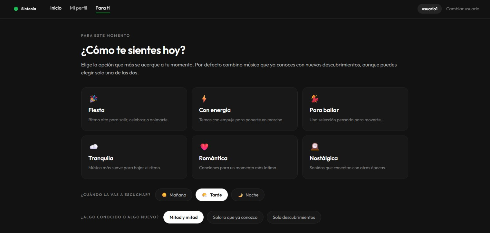
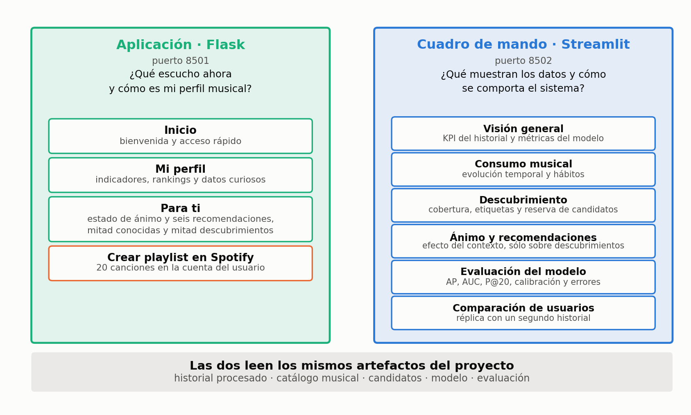

# Sintonía

**Data-driven music recommendation system built from a real Spotify listening history.**

End-to-end data project: ETL of raw streaming logs → enrichment with external APIs → behavioural
target engineering → temporally validated ML model → recommendation engine → Flask app and
Streamlit analytics dashboard, orchestrated with Docker Compose.


---

## Overview

Sintonía is a personal music assistant developed as my **Master's Thesis in Big Data**
(Universidad Europea de Andalucía, 2025–2026).

Spotify's listening history has no explicit ratings: no likes, no stars. The project turns more than
**150,000 raw plays** (151,599 after cleaning, Sept 2019 – June 2026) into a system that estimates how
likely a song is to *stick* with the user and recommends a mix of familiar music and new
discoveries, adapted to the moment and the mood the user chooses.

Everything runs locally. The listening history is never sent to an external service.

## What the project does

| Area | What it does |
|---|---|
| **ETL** | Ingests Spotify's JSON export, removes personal fields (IP address, offline timestamp), separates music from podcasts, cleans duplicates and zero-length plays, derives time features and writes a data-quality report |
| **Storage** | Parquet as the analytical source of truth, MongoDB as the query layer for both interfaces (with automatic fallback to Parquet) |
| **Data enrichment** | Artist genre tags from Last.fm and MusicBrainz, similar artists and top tracks from Last.fm, with a resumable SQLite response cache and rate limiting |
| **Listening profile** | Hours, distinct tracks and artists, skip rate, concentration and yearly evolution |
| **Affinity prediction** | Logistic Regression trained on 17 features and a behaviour-based target |
| **Contextual recommendation** | Time of day and weekend are model inputs at recommendation time |
| **Mood-based recommendations** | Six moods mapped to genre tags and blended with the model score |
| **Known music + discovery** | Two independent rankings, merged 50/50, with a cap per artist and a daily rotation |
| **Explanations** | Each recommendation comes with a reason based on the signals the system actually used |
| **Interfaces** | Flask user app (profile, recommendations, optional private Spotify playlist) and a Streamlit analytics dashboard |

## Architecture



Original thesis diagram (Spanish labels): data sources → ingestion → processing → storage →
consumption, with Docker Compose orchestration and privacy controls on top.



**Docker Compose services** (`docker-compose.yml`): `mongo` (MongoDB 7), `web` (Flask, port 8501),
`dashboard` (Streamlit, port 8502) and `jupyter` (analysis notebooks, port 8888). All three Python
services share one image; the web app and dashboard wait for a MongoDB health check before starting.

## Data pipeline

```
Raw JSON  →  minimisation  →  music / podcast split  →  cleaning  →  derived features  →  Parquet
                                                                                              │
                              Last.fm + MusicBrainz (cached)  →  shared artist tag catalogue ─┤
                                                                                              ▼
                                                   modelling dataset · candidates · MongoDB collections
```

Result of the ETL on the development history (from the generated quality report):

| Step | Records |
|---|---|
| Raw records (15 files) | 153,242 |
| Podcasts separated | 140 |
| Exact duplicates removed | 172 |
| Zero-length plays removed | 513 |
| Outside selected period | 818 |
| **Clean plays** | **151,599** (17,886 tracks · 6,120 artists) |

Design decisions worth noting:

- **Per-user data vs shared catalogue.** Each user's history, candidates and model live in their own
  folder and MongoDB documents (`user_id`), so a user can be fully deleted with one command. Artist
  tags describe artists, not people, so the catalogue is shared and only grows with new artists.
- **Resilient I/O.** All table reads and writes go through one module that uses Parquet and falls back
  to compressed CSV if no Parquet engine is available.
- **Catalogue versioning.** Every enrichment run logs the catalogue state, so results can be traced to the
  catalogue they were produced with.

Code: [`etl/spotify.py`](src/asistente/etl/spotify.py) ·
[`etl/enriquecimiento.py`](src/asistente/etl/enriquecimiento.py) ·
[`datos/mongo.py`](src/asistente/datos/mongo.py) ·
[`datos/acceso.py`](src/asistente/datos/acceso.py)

## Machine Learning

**Problem.** Binary classification with imbalanced classes (≈15 % positives). Because there are no
explicit ratings, the target is built from behaviour: a song is positive if, within **30 days** of its
first play, it is replayed **at least twice for more than 30 seconds**.

**Features (17)**, all computed with information available *before* the first play to avoid leakage:

- **Artist history (6):** previous plays and songs of the artist, days since last play, new artist flag,
  previous replay and skip rates
- **Listening context (5):** hour, weekend, late night, shuffle, active choice vs. autoplay
- **Recent activity (3):** plays, new songs and discovery rate in the previous 30 days
- **Content (3):** cosine affinity between the artist's tags and the user's tag profile, number of tags,
  artist without tags

**Protocol.** Strictly temporal split: train 2019–2023, validation 2024, test 2025–June 2026. Three
model families (Logistic Regression, Random Forest, Gradient Boosting) were tuned with randomized
search and `TimeSeriesSplit` cross-validation, and compared against two baselines. The main metric is
**Average Precision**, with ROC AUC, Precision@20/50 and Brier score as secondary metrics.

**Model selection (validation, 2024).** Logistic Regression 0.298 AP, Gradient Boosting 0.297,
Random Forest 0.288. The two best were tied, so Logistic Regression was chosen for being simpler, faster
and interpretable.

**Final test (2025 – June 2026)**, as recorded in the executed model notebook:

| Model | AP | ROC AUC | P@20 |
|---|---|---|---|
| Baseline: informed random | 0.153 | 0.500 | 0.16 |
| Baseline: artist familiarity | 0.245 | 0.562 | 0.95 |
| **Logistic Regression** | **0.303** | **0.680** | **0.95** |

Honest reading of the results: the model roughly doubles the random baseline's AP and improves on the
familiarity heuristic by about 24 %. The heuristic is just as good in the top 20 but much worse across the
whole ranking. An ablation study showed that most of the gain comes from the three content features.
Probabilities are not well calibrated (a consequence of `class_weight="balanced"`), so the app shows
rankings rather than percentages.

<p>
  
  
</p>

Code: [`modelado/caracteristicas.py`](src/asistente/modelado/caracteristicas.py) (target, features,
temporal split) · [`modelado/entrenar.py`](src/asistente/modelado/entrenar.py) (training, baselines,
metrics, calibration)

## Recommendation Engine



1. **Two catalogues.** *Known tracks* come from the user's own history. *Discoveries* are top tracks of
   artists that Last.fm lists as similar to the user's most played artists, re-checked against the history
   (normalised names) so no known artist slips in.
2. **Scoring.** Both catalogues are scored by the same model with the same 17 features. Context features
   come from the moment of the request (time of day, weekend).
3. **Mood.** Each mood maps to Last.fm genre tags, since genre tags were far better covered than mood
   tags in the catalogue. The final score is a linear blend of model score and mood affinity.
4. **Two independent rankings, merged 50/50.** Artist-level features favour familiar artists, so a single
   ranking would be almost entirely known music. Separate rankings guarantee the mix.
5. **Diversity.** At most two songs per artist, plus a rotation window: songs are sampled from the top of
   the ranking in proportion to their score, seeded with the date so the list is stable during the day
   and refreshes the next day.
6. **Explanations.** Play count and last play for known songs, and the seed artist and Last.fm similarity
   for discoveries, plus shared tags and mood tags.

Code: [`recomendacion/recomendador.py`](src/asistente/recomendacion/recomendador.py) ·
[`recomendacion/animo.py`](src/asistente/recomendacion/animo.py)

## Interfaces

| Flask user app | Streamlit analytics dashboard |
|---|---|
| Listening profile with a year filter | Overview KPIs and model metrics |
| Mood, time of day and known/new mix selection | Listening habits over time |
| Six explained recommendations | Enrichment coverage and discovery candidates |
| Optional private Spotify playlist (OAuth, `playlist-modify-private` scope only) | Mood effect, model evaluation (PR curves, calibration) and a comparison with a second user |

Code: [`web/`](src/asistente/web) · [`dashboard/`](src/asistente/dashboard)

## Screenshots

**Listening profile** (aggregate figures only)



**Mood and context selection**



**The two interfaces and their screens**



## Tech Stack

| | |
|---|---|
| **Language** | Python 3.12 |
| **Data processing** | pandas, NumPy |
| **Storage** | Parquet (pyarrow), MongoDB 7 (pymongo), SQLite (API response cache) |
| **External data** | Last.fm API, MusicBrainz API, Spotify Web API (OAuth, playlists) |
| **Machine Learning** | scikit-learn (Logistic Regression, Random Forest, HistGradientBoosting, TimeSeriesSplit) |
| **Visualisation** | Streamlit, Plotly, matplotlib, seaborn |
| **Web** | Flask, Jinja2, HTML/CSS |
| **Environment** | Docker, Docker Compose, JupyterLab, Git |

## Repository structure

```
sintonia-music-recommender/
├── README.md
├── docker-compose.yml        mongo · web · dashboard · jupyter
├── Dockerfile                shared image for the Python services
├── requirements.txt
├── .env.example              configuration template (no real values)
├── src/asistente/
│   ├── config.py             paths and parameters in one place
│   ├── etl/                  Spotify ETL and API enrichment
│   ├── modelado/             target variable, features, training
│   ├── recomendacion/        recommendation engine and mood mapping
│   ├── datos/                MongoDB loading and data access with Parquet fallback
│   ├── utilidades/           Parquet / CSV I/O
│   ├── web/                  Flask app, Spotify OAuth, playlists
│   └── dashboard/            Streamlit dashboard
├── sample_data/              synthetic Spotify-format sample (28 fictitious records)
└── docs/
    ├── architecture/         architecture and methodology diagrams
    ├── results/              model evaluation figures
    └── screenshots/
```

The code, comments and module names are in Spanish, as in the original thesis.

## Repository scope

This repository contains a **curated version** of the project, focused on its main data engineering,
machine learning and recommendation components. The following were **intentionally excluded**:

- personal listening data (raw JSON exports, processed Parquet files, trained models, API caches) for
  all users involved;
- analysis notebooks and additional experiments, because their outputs contain personal listening
  details;
- the thesis report, defence materials and university forms;
- local configuration and credentials.

## Running the project

The original system was built on **private Spotify listening histories, which are not included**. The
full application and dashboard therefore **cannot be reproduced from this repository alone**: they
need a processed history, the enriched catalogue and a trained model.

What you can run with the included synthetic sample is the **ETL step**:

```bash
pip install -r requirements.txt
PYTHONPATH=src python -m asistente.etl.spotify --usuario demo \
    --input sample_data/raw --min-date 2019-01-01
```

It writes the cleaned table and a data-quality report to `datos/usuarios/demo/` (git-ignored).
See [`sample_data/README.md`](sample_data/README.md).

With your own Spotify *Extended Streaming History* export and a free Last.fm API key, the full pipeline
runs in this order:

```bash
cp .env.example .env              # add your own keys and a JUPYTER_TOKEN
docker compose up -d --build
docker compose run --rm web python -m asistente.etl.spotify --usuario usuario1 --min-date 2019-09-01
docker compose run --rm web python -m asistente.etl.enriquecimiento --usuario usuario1
docker compose run --rm web python -m asistente.modelado.entrenar --usuario usuario1
docker compose run --rm web python -m asistente.datos.mongo cargar --todos
```

Place the JSON files in `datos/usuarios/usuario1/bruto/` first. The web app is served at
`http://127.0.0.1:8501` and the dashboard at `http://localhost:8502`.

Note: `entrenar.py` applies the model configuration chosen in the original thesis notebooks
(Logistic Regression, C = 0.03). It does not repeat the model comparison.

## Limitations

- The target is a behavioural proxy for "liking" a song, not an explicit rating.
- Most features describe the artist, so songs by the same artist get the same score. Ties are broken by
  play count and recency.
- Mapping moods to genres is a design choice, not a learned relationship.
- Discovery candidates depend on Last.fm coverage, and less-known artists get fewer tags.
- Developed and evaluated locally on a small number of real users. It is an academic prototype, not a
  deployed product.

---

**Alejandra Díaz López** · Master's in Big Data and Business Intelligence · Multimedia Engineering background
